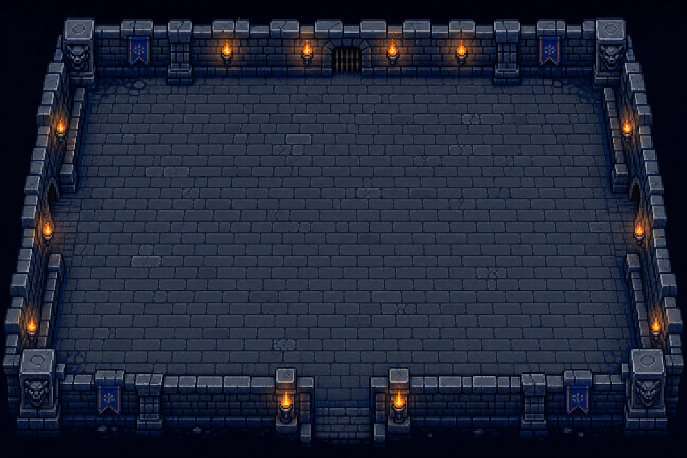
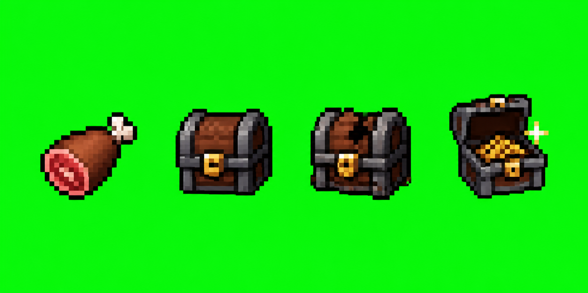
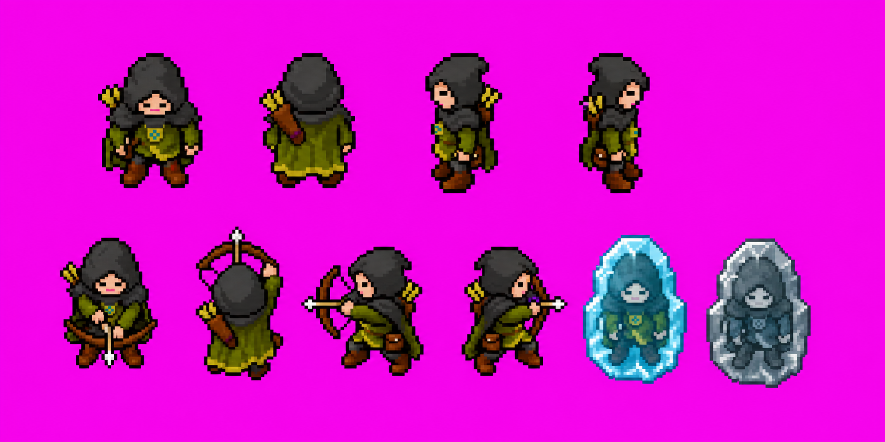
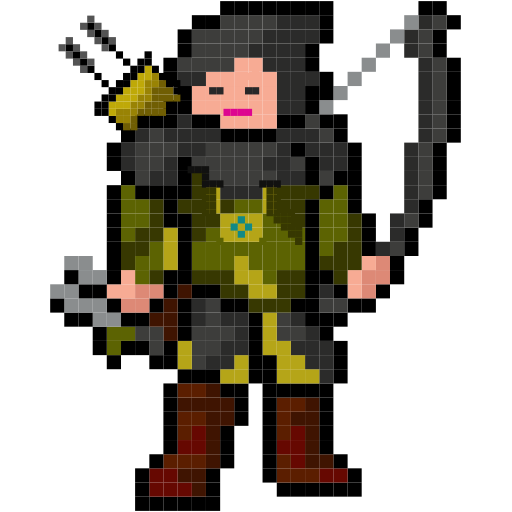

# Phase 6 Art Review

This folder contains the first review pack for Roundtable Melee Phase 6. These
are not wired into gameplay yet. Review and approve or redirect the visual style
before the art pipeline is scaled across all characters.

## Review Assets

Approved assets have been extracted into runtime files with:

```bash
npm run assets
```

Production outputs:

```txt
public/backgrounds/arena-dungeon.png
public/sprites/items.png
public/sprites/items.json
public/sprites/characters/*.png
public/sprites/characters/*.json
public/sprites/characters/*-preview.png
public/sprites/ranger-poses.png
public/sprites/ranger-poses.json
```

### Arena



Path:

```txt
assets-src/art-review/arena-dungeon-v1.png
```

Notes:

- Strong fit for the requested grey/blue dungeon feel.
- Clear central combat space.
- Torches and walls are readable.
- More polished than strict 8-bit, but close enough to use as a style target or
  downsample/quantize into the final background.

Prompt:

```txt
Create an 8-bit pixel-art dungeon arena for a top-down, slightly above-and-behind multiplayer melee game. Use grey and blue stone brick floors, darker brick walls, torch sconces mounted along the walls, small warm torchlight accents, and a clear open central fighting space for up to ten small fantasy character sprites. Keep the composition readable for gameplay: obvious walkable floor, clear boundaries, minimal clutter, no large central obstacles, and enough empty space for melee movement. Use a moody dungeon palette dominated by greys, slate blues, deep navy shadows, and small orange flame highlights. Output as crisp pixel art with hard edges, no blur, no painterly texture, no text, no logos, no HUD, no watermark.
```

### Item Sprites



Path:

```txt
assets-src/art-review/items-v1-chroma.png
```

Notes:

- Ham and chest states are immediately readable.
- Chroma background should be removable.
- The render is more polished/large than strict 8-bit; likely needs
  downsampling, quantization, and cell extraction before production use.

Prompt:

```txt
Create a compact pixel-art sprite sheet with item sprites for Roundtable Melee: ham pickup, closed treasure chest, damaged treasure chest, opened treasure chest. Use a perfectly flat solid #00ff00 chroma-key background. Arrange four separate game item sprites in a single row with generous spacing: 1 ham pickup, 1 closed treasure chest, 1 cracked/damaged chest, 1 opened chest with small gold glint. Use crisp 8-bit pixel art, retro fantasy dungeon game item sprites, hard edges, readable at small size. No labels, no text, no UI, no watermark. Do not use #00ff00 in any sprite.
```

### Ranger Pose Sheet



Reference:



Path:

```txt
assets-src/art-review/ranger-pose-sheet-v1-chroma.png
```

Notes:

- Good Ranger identity carryover: hood, green cloak, boots, small accent.
- Directional reads are clear.
- Frozen and disconnected-frozen are visually distinct.
- Attack poses currently read as bow/ranged attacks, not melee slashes.
- The style is closer to polished 16-bit/isometric than Hack Thy Sack's simpler
  8-bit sprites. If approved as direction, we should make the whole game match
  this richer sprite style. If not, iterate toward chunkier/lower-detail sprites.

Prompt:

```txt
Create a compact 8-bit pixel-art pose sheet for the Raid Guild Ranger character for a top-down, slightly above-and-behind dungeon melee game. Use the Ranger reference for colors and silhouette: dark hood, green cloak/tunic, boots, small satchel/amulet accent. Include ten separate sprites arranged in a clean grid: idle/down, idle/up, idle/left, idle/right, attack/down, attack/up, attack/left, attack/right, frozen in blue ice, disconnected-frozen in desaturated grey-blue ice. Use a perfectly flat solid #ff00ff chroma-key background. No labels, no text, no UI, no watermark. Do not use #ff00ff in any sprite.
```

## Recommended Next Iteration

Before extracting sprites, choose one of these directions:

1. Keep this richer pixel-art direction and make the game feel more like a
   polished dungeon arcade crawler.
2. Iterate all assets toward chunkier, lower-detail 8-bit visuals closer to Hack
   Thy Sack.
3. Keep the arena but regenerate character/item sprites simpler and more
   melee-focused.
